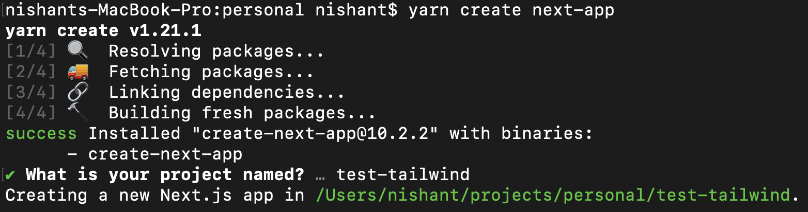

### Why Next.js?

Before we start with we should know this.

It’s open-source, based on Node.js and Babel, and it integrates with React to develop single-page applications. It makes Serversside rendering very easy.

> With Next.js, server rendering React applications has never been easier, no matter where your data is coming from.

Next.js also supports static exporting, pre-Rendering, and has a lot more nice features like automatic building size optimization, faster dev compilation, and preview mode.

### Let's start a new Next.js project

Considering you have already installed Yarn, open your terminal and run **`yarn create next-app`** in your projects folder.

You will get prompted with the following message:



Fill in a name, hit enter, and wait until your project is ready. Then, type cd `your-project-name` to make sure you are inside that directory where you can run yarn dev to start the development server. You should now have your new Next.js project up and running.


### Now we will install Tailwind CSS Dependencies:

Tailwind CSS is a plugin built on PostCSS, a tool for transforming CSS with JavaScript. The v2.0 has been updated for the latest PostCSS release, which requires installing postcss and autoprefixer as peer dependencies alongside Tailwind itself.
Add Tailwind and install PostCSS as well as autoprefixer using npm or yarn:

```
yarn add tailwindcss postcss autoprefixer
```

### Create Config files

We need to add a `tailwind.config.js` and a `postcss.config.js` file to the root of our application. Use the following command to set this up:

```
npx tailwindcss init -p
```

This will create a tailwind.config.js file at the root of your project:

**tailwind.config.js**

```
module.exports = {
  purge: [],
  darkMode: false, // or 'media' or 'class'
  theme: {
    extend: {},
  },
  variants: {
    extend: {},
  },
  plugins: [],
}
```

It will also create a postcss.config.js file that includes tailwindcss and autoprefixer configured:

**postcss.config.js**

```
module.exports = {
  plugins: {
    tailwindcss: {},
    autoprefixer: {},
  },
}
```

### Now we need to import css

Let’s create a styles folder and import Tailwind CSS from a CSS file:

```
touch styles/tailwind.css
```

Inside tailwind.css:

```
@tailwind base;
@tailwind components;
@tailwind utilities;
```

To add global CSS to a Next.js app, we need to override the default App component. With Next.js 10, you should already have \_app.js inside your pages folder. Now import the stylesheet we created:

```
import '../styles/globals.css'
import '../styles/tailwind.css';

function MyApp({ Component, pageProps }) {
  return <Component {...pageProps} />
}

export default MyApp
```

Great, now we are ready to add some Tailwind CSS magic to our home page. Go to /pages/index.js (or /pages/index.tsx if you use TypeScript) and add some elements with Tailwind CSS classes. For example:

```
export default function Home() {
  return (
    <div className="flex rounded-lg p-24 justify-center">
      
      <div className="text-center md:text-left">
        <h2 className="text-lg font-bold">Nishant Ranjan</h2>
        <div className="text-purple-600">QA Engineer</div>
        <div className="text-gray-600">Twitter: @nishu2811</div>
        <div className="text-gray-600">nishantranjan.in</div>
      </div>
    </div>
  );
}
```

Output:


#### Configure PurgeCSS:

One problem with Tailwind CSS is the large file size, but PurgeCSS can fix this. PurgeCSS reduces the file size by scanning your HTML and removing any classes that aren’t used. We only want this in production because if we are developing, we want to be able to use any Tailwind CSS class without running the build process.

Now with Tailwind CSS v2, PurgeCSS is already included. All you have to do is update the tailwind.config.js file so Tailwind can tree-shake unused styles in production builds. Update your file like this:

```
purge: [
    './pages/**/*.{js,jsx,ts,tsx}',
      './components/**/*.{js,jsx,ts,tsx}',
  ],
```

For now, we check all of our code inside .js, .jsx, .ts or .tsx files that live in either the pages/ or components/ folder. If you plan to add HTML in other folders like containers/ or something, make sure you add that folder to this configuration file.
